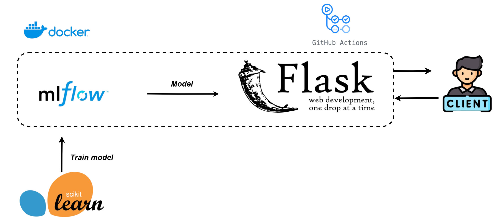

#  Iris Flow API

**IrisFlowAPI** is a complete machine learning project focused on classifying Iris flowers (Setosa, Versicolor, Virginica). It integrates the entire MLOps pipeline — from model training and experiment tracking to serving predictions through a production-ready API.




## 🔍 Project Overview

This project trains a supervised learning model on the classic Iris dataset. The model is managed and tracked using **MLflow**, ensuring reproducibility and experiment versioning. Once trained, the model is served via a RESTful API built with **Flask**, allowing external applications to send requests and receive predictions.

## 🚀 Features

- Supervised model training with evaluation metrics
- Model tracking and versioning with MLflow
- RESTful API using Flask to serve real-time predictions
- Dockerized infrastructure with separate containers for API and MLflow
- Unit tests and Integration for endpoints and internal modules

## 🧰 Tech Stack

- Python 3.11
- Flask
- MLflow
- Scikit-learn
- Docker & Docker Compose
- Pytest

### Running the project

```bash
docker-compose up --build
```
* The MLflow server will be on port ``5000`` and the API on port ``3000``. To perform a prediction send a POST with the following body to ``/predict``:

```
{
  "sepal_length": 5.1,
  "sepal_width": 3.5,
  "petal_length": 1.4,
  "petal_width": 0.2
}
```
The following response will be returned:
```
{
  "prediction": "setosa",
  "proba_max": 0.97
}
```
The Swagger is available in ``/apidocs``.

# For Future Work

# Contributing

1. Fork the repository.
2. Create a branch for your changes (`git checkout -b feature/new-feature`).
3. Commit your changes (`git commit -am 'Add new feature'`).
4. Push to the branch (`git push origin feature/new-feature`).
5. Open a pull request.

# Contact

- **LinkedIn**: [engmarcelocolares](https://www.linkedin.com/in/engmarcelocolares/)